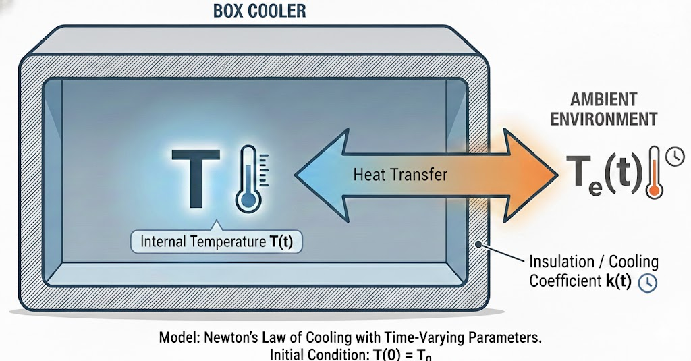
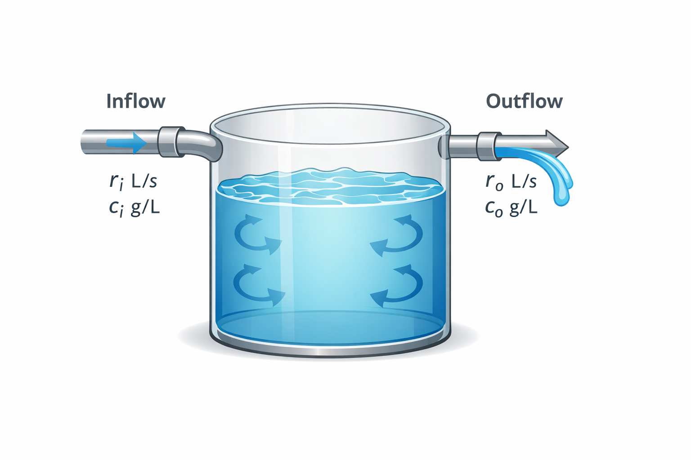
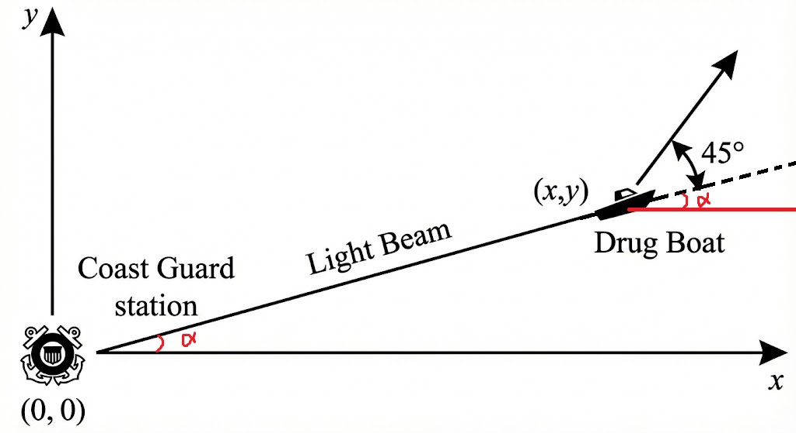
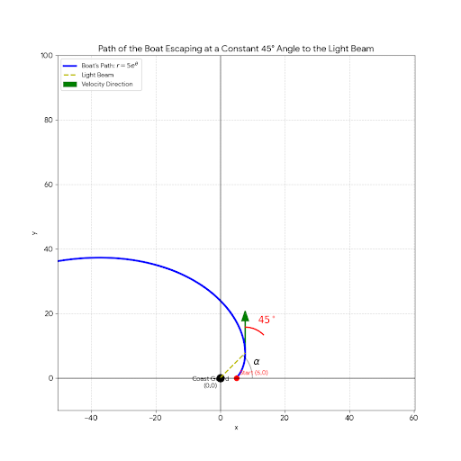

# Chapter 1: 
---

## 1. The Applied Math Modeling Cycle
Applied mathematics involves using mathematical tools to solve real-world problems. The process follows a continuous loop:

* **Formulation:** Expressing a real-world problem in mathematical language.
* **Modeling:** Building mathematical models based on assumptions and approximations.
* **Analysis/Solving:** Using mathematical tools to find unknown solutions (e.g., $x(t)$).
* **Validation:** Collecting data through experiments to validate the model. 
	* *Note:* If a model (like a pendulum) predicts constant motion but reality shows it slowing down, the model must be refined to include friction.

---

## 2. Ordinary Differential Equations (ODEs)

### Terminology & Classification
* **ODE:** An equation involving a function and its derivatives where there is only one independent variable. 
	* $F(x,y,y',\cdots,y^{(n)})=0$ where $x$ is the independent variable and $y$ is the dependent variable. The unknown is a function $y(x)$.   
* **Variables:**
    * **Independent:** Usually time ($t$) or position ($x$).
    * **Dependent:** The variable being solved for (e.g., $y$, $x$, or $P$).
* **Parameters:** Constants within the system (e.g., mass $m$ or spring constant $k$).
* **Order:** Determined by the highest derivative present (e.g., $y^{(n)}$ is an $n$-th order ODE).

* A general $n$-th order **linear** ODE is expressed as: $$a_n(x)y^{(n)} + a_{n-1}(x)y^{(n-1)} + \dots + a_1(x)y' + a_0(x)y + b(x)=0.$$ 
	* Note: linearity is in terms of $y$ and its derivatives. 

### Classical Examples
**A. Mass-Spring System (Newton's 2nd Law)**
Using the principle of $F = ma$ and Hooke's Law ($F = -kx$):
$$m \frac{d^2x}{dt^2} = -kx$$
This describes Simple Harmonic Motion, which has a **general solution**:
$$x(t) = A \cos(\omega t) + B \sin(\omega t)$$
*The coefficients $A$ and $B$ are determined by Initial Conditions (I.C.): $x(0) = x_0$ and $x'(0) = x'_0$ resulting in a **particular solution**.* 

**B. Population Growth**
The rate of change is proportional to the current population:
$$\frac{dP}{dt} = kP \implies P(t) = P_0 e^{kt}$$

**Note**: a solution can be verified by substituting it to the ODEs and check if the equations hold.

---

## 3. Analytic Methods for First-Order ODEs

### Direct Integration (§1.2)
If the derivative depends only on the independent variable:
$$\frac{dy}{dx} = f(x) \implies y(x) = \int f(x) dx + C$$

### Separable Equations (§1.4)
Used when variables can be moved to opposite sides of the equation:
$$\frac{dy}{dx} = \frac{f(x)}{g(y)} \implies \int g(y) dy = \int f(x) dx$$

### Linear First-Order ODEs (§1.5) (2nd week topic)
Standard form: $y' + p(x)y = q(x)$.
These are solved using an **Integrating Factor**:
$$\mu(x) = e^{\int p(x) dx}$$

#### Example (Crawfish trap) $y' = 1 + x - y$
Note that this is a first-order linear ODE,  we first rewrite it in the standard form:

$$y' + y = 1 + x$$

##### Step 1: Identify the components
This is a linear equation of the form $y' + P(x)y = Q(x)$, where:
* $P(x) = 1$
* $Q(x) = 1 + x$

##### Step 2: Find the integrating factor
The integrating factor, $\mu(x)$, is:
$$\mu(x) = e^{\int P(x) dx} = e^{\int 1 dx} = e^x$$

##### Step 3: Multiply and integrate
Multiply the entire differential equation by $e^x$ to make the left side a recognizable derivative:
$$\frac{d}{dx}(y e^x) = e^x(1 + x)$$

Now, integrate both sides with respect to $x$:
$$y e^x = \int (e^x + xe^x) dx$$

Applying integration by parts to the second term:
$$y e^x = e^x + (xe^x - e^x) + C$$
$$y e^x = xe^x + C$$

##### Step 4: Solve for $y$
Divide by $e^x$ to isolate the general solution:
$$y(x) = x + Ce^{-x}$$

Note that for $x\to +\infty$, $y(x)\to x$. All solutions eventually converge to this particular solution. The slope field analysis also reveal this asymptotics (see the example in the section of Geometric & Qualitative Analysis).    

#### Example (cooler) $\frac{dT}{dt} = k(t)(T_e(t) - T)$

Note this is again a 1st order linear equation. This equation models temperature inside a cooler, where $T_e$ is the external temperature and $k(t)>0$ is the conductance (how insulated the cooler is).  

##### Step 1: Standard Linear Form
Rearrange the equation into the standard form $\frac{dT}{dt} + P(t)T = Q(t)$:
$$\frac{dT}{dt} + k(t)T = k(t)T_e(t)$$

Here, $P(t) = k(t)$ and $Q(t) = k(t)T_e(t)$.

#### Step 2: Determine the Integrating Factor
The integrating factor $\mu(t)$ is defined as:
$$\mu(t) = e^{\int_0^t k(s) ds}$$

#### Step 3: Multiply and Integrate
Multiplying the standard form by $\mu(t)$ allows us to write the left side as a total derivative:
$$\frac{d}{dt} \left[ e^{\int_0^t k(s) ds} T(t) \right] = k(t)T_e(t) e^{\int_0^t k(s) ds}$$

Integrating both sides from $0$ to $t$:
$$e^{\int_0^t k(s) ds} T(t) - T(0) = \int_0^t k(\tau) T_e(\tau) e^{\int_0^\tau k(s) ds} d\tau$$

#### Step 4: Final General Solution
Isolating $T(t)$ and substituting $T(0) = T_0$:
$$T(t) = T_0 e^{-\int_0^t k(s) ds} + e^{-\int_0^t k(s) ds} \int_0^t k(\tau) T_e(\tau) e^{\int_0^\tau k(s) ds} d\tau$$

The first term represents the decay of the initial temperature, while the second term (the convolution-like integral) represents the influence of the shifting ambient temperature.

In the case $k$ and $T_e$ are constant, $T(t)=T_e+e^{-kt}T_0, which shows the temperature eventually equilibrates to the constant external temperature.

In the case $k$ is constant and $T_e=\sin(\omega t)$, $$T=\frac{k}{\sqrt{k+\omega}}\sin(\omega t -\arctan(\frac{\omega}{k}))+(T_0+\frac{k\omega}{k^2+\omega^2})e^{-kt}$$. The first term is the steady state solution and second term represents transients. How do the amplitude and frequency of the steady state solution  compare to the external fluctuation.  

#### Example (mixture) 
Derive an ODE that describes the amount of the solute in side the tank with in flow rate $r_i$ L/s and concentration $c_i$ g/L and outflow rate $r_o$ L/s and $c_o$ g/L. 

Let $x(t)$ be the amount of solute in the tank (g) at time $t$, and let $V(t)$ be the volume of liquid in the tank (L).

Over a small time interval $[t, t+\Delta t]$,

$$
x(t+\Delta t)-x(t)=\text{(solute in)}-\text{(solute out)}.
$$

##### Solute in during $\Delta t$
Inflow rate $r_i$ (L/s), inflow concentration $c_i$ (g/L):

$$
\text{in}=(r_i c_i)\Delta t.
$$

### Solute out during $\Delta t$
Assume the tank is well-mixed, so the outflow concentration equals the tank concentration:

$$
c_o(t)=\frac{x(t)}{V(t)} \quad (\text{g/L}).
$$

Outflow rate $r_o$ (L/s), so solute leaving in $\Delta t$ is approximately

$$
\text{out}=\left(r_o \frac{x(t)}{V(t)}\right)\Delta t.
$$

### Finite-difference equation
Substitute in/out into the balance:

$$
x(t+\Delta t)-x(t)=(r_i c_i)\Delta t-\left(r_o \frac{x(t)}{V(t)}\right)\Delta t.
$$

Divide by $\Delta t$:

$$
\frac{x(t+\Delta t)-x(t)}{\Delta t}
= r_i c_i-r_o\frac{x(t)}{V(t)}.
$$

### ODE (take $\Delta t \to 0$)
$$
\lim_{\Delta t\to 0}\frac{x(t+\Delta t)-x(t)}{\Delta t}
=\frac{dx}{dt}
$$

so

$$
\boxed{\frac{dx}{dt}=r_i c_i-r_o\frac{x(t)}{V(t)}}.
$$
Note that this is a 1st order linear equation.

### Volume equation (if needed)
The volume changes by inflow minus outflow:

$$
V(t+\Delta t)-V(t)=(r_i-r_o)\Delta t
$$

so

$$
\boxed{\frac{dV}{dt}=r_i-r_o},
\qquad
V(t)=V_0+(r_i-r_o)t.
$$

**Constant-volume special case:** if $r_i=r_o=r$, then $V(t)=V_0$ and

$$
\boxed{\frac{dx}{dt}=r c_i-\frac{r}{V_0}x}.
$$

### Substitution method(§1.4)
Use substitution to reduce an ODE to a type that we know how to solve. Common ones are listed below:

#### for $\frac{dy}{dt}=F(ax+by+c)$,
using $v=ax+by+c$ gives $\frac{dv}{dx}=bF(v)+a$ which is separable.

#### for ("homogenous") $\frac{dy}{dx}=F(\frac{y}{x})$,
using $v=\frac{y}{x}$ gives $x\frac{dv}{dx}=F(v)-v$ which is separable.

#### for the Bernoulli equation $\frac{dy}{dx}+p(x)y=q(x)y^n$, using $v=y^{1-n}$ gives $\frac{dv}{dx}+(1-n)p(x)v=(1-n)q(x)$ which is a 1st order linear equation. 

#### Example (drug boat)
Coast guard shines a light beam at a drug boat. The drug boat tries to escape with a 45 degree angle to the light beam. Let the coast guard position be the origin. Find the path of the boat.   

### Solution: Deriving the Logarithmic Spiral in Cartesian Coordinates

We want to solve the differential equation representing the boat's path, where the velocity vector always maintains a $45^\circ$ angle relative to the position vector (the light beam).

**Given:**
1.  $\tan(\alpha) = y/x$ (The angle of the position vector).
2.  The boat's direction is $\alpha + 45^\circ$.
3.  $\frac{dy}{dx} = \tan(\alpha + 45^\circ)$.

#### Step 1: Expand the Tangent Function
Using the angle sum identity $\tan(A+B) = \frac{\tan A + \tan B}{1 - \tan A \tan B}$ with $\tan(45^{\circ}) = 1$:

$$
\frac{dy}{dx} = \frac{\tan(\alpha) + 1}{1 - \tan(\alpha)}
$$

Substitute $\tan(\alpha) = y/x$:

$$
\frac{dy}{dx} = \frac{\frac{y}{x} + 1}{1 - \frac{y}{x}}
$$

Multiply numerator and denominator by $x$ to simplify:

$$
\frac{dy}{dx} = \frac{y + x}{x - y}
$$

#### Step 2: Solve the Homogeneous ODE
This is a homogeneous differential equation. We use the substitution $y = vx$, which implies $\frac{dy}{dx} = v + x\frac{dv}{dx}$.

Substitute this into the equation:

$$
v + x\frac{dv}{dx} = \frac{vx + x}{x - vx} = \frac{x(v+1)}{x(1-v)}
$$

$$
v + x\frac{dv}{dx} = \frac{v+1}{1-v}
$$

#### Step 3: Separate Variables
Subtract $v$ from the right side:

$$
x\frac{dv}{dx} = \frac{v+1}{1-v} - v = \frac{v+1 - v(1-v)}{1-v}
$$

$$
x\frac{dv}{dx} = \frac{1 + v^2}{1-v}
$$

Rearrange to separate $x$ and $v$:

$$
\frac{1-v}{1+v^2} dv = \frac{dx}{x}
$$

#### Step 4: Integrate
Split the left side into two standard integrals:

$$
\int \frac{1}{1+v^2} dv - \int \frac{v}{1+v^2} dv = \int \frac{dx}{x}
$$

1.  $\int \frac{1}{1+v^2} dv = \arctan(v)$
2.  $\int \frac{v}{1+v^2} dv = \frac{1}{2}\ln(1+v^2)$

This yields the implicit solution:

$$
\arctan(v) - \frac{1}{2}\ln(1+v^2) = \ln|x| + C
$$

#### Step 5: Interpretation (Polar Conversion)
To visualize the path, we convert back to polar coordinates where $v = y/x = \tan(\theta)$ and $x = r\cos(\theta)$.

Substituting these back into the solution simplifies to the polar equation:

$$
\ln(r) = \theta - C \quad \Rightarrow \quad r = A e^{\theta}
$$

This confirms the path is a **Logarithmic Spiral**.

---

## 4. Geometric & Qualitative Analysis

### Slope Fields (Direction Fields)
When an ODE is difficult to solve analytically, we visualize it geometrically.
* **Slope Field:** A grid of small lines representing the slope $f(x, y)$ at various points.
* **Integral Curve:** A curve that is tangent to the slope field everywhere; this represents a specific solution.
* **Isoclines:** Curves where the slope $f(x, y) = m$ is constant. These are used to draw slope fields more efficiently.

#### Example (Exponential growth or decay) $y' = k y$
 

#### Example (Crawfish trap) $y' = 1 + x - y$

*note:* all solutions got trapped not matter where it starts and eventually approach $y=x$. $y=x$ is both the isocline of slope 1 and the asymptotic solution  

#### [Clink here to plot slope field using a computer](https://github.com/MathWorks-Teaching-Resources/Phase-Plane-and-Slope-Field) 

### Existence and Uniqueness (E&U)
* **Uniqueness:** In general, integral curves cannot cross or touch. If they did, a single point would have two different solutions.
* **The E&U Theorem:** if both $f(x, y)$ and $\frac{\partial f}{\partial y}$ are continuous near $(a,b)$,$y'=f(x,y)$ has one and only one solution through $(a, b)$ 
	* Note: this theorem only concerns "locally" near a point  $(a, b)$. We do not know when E&U breaks down. See the example below:

 **Example:** ("finite time blow-ups" where a solution goes to infinity in finite time) Consider 
 $$\frac{dy}{dt}=y^2$$
  with $y(0)=1$ 
- separation of variable gives a solution $y=1/(1-t)$. So the solution starting from (0,1) cannot cross $t=1$ 
-  contrast it with exponential growth $\frac{dy}{dt}=y$ with $y(0)=1$

**Example:** (Dichotomous flower) $x y' = y-1$
E&U theorem guarantees E&U everywhere except $x=0$. Examining $x=0$ shows that at (0,1) there many solutions whereas everywhere else on $x=0$ there is no solution. 

*note:* isoclines are also solutions

**Example:** (singularity due to choice of coordinates) 
$$x+yy'=0$$
separation of variable gives  implicit solution $x^2+y^2 = C$. E&U theorem guarantees E&U everywhere except at $y=0$. In fact, solutions do not exist at $y=0.$ However changing to polar coordinate resolve this issue. 

