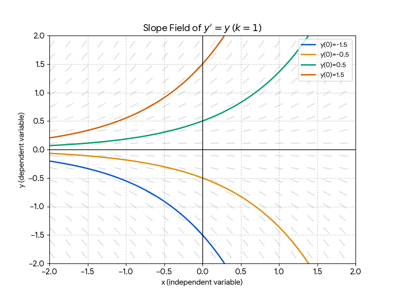
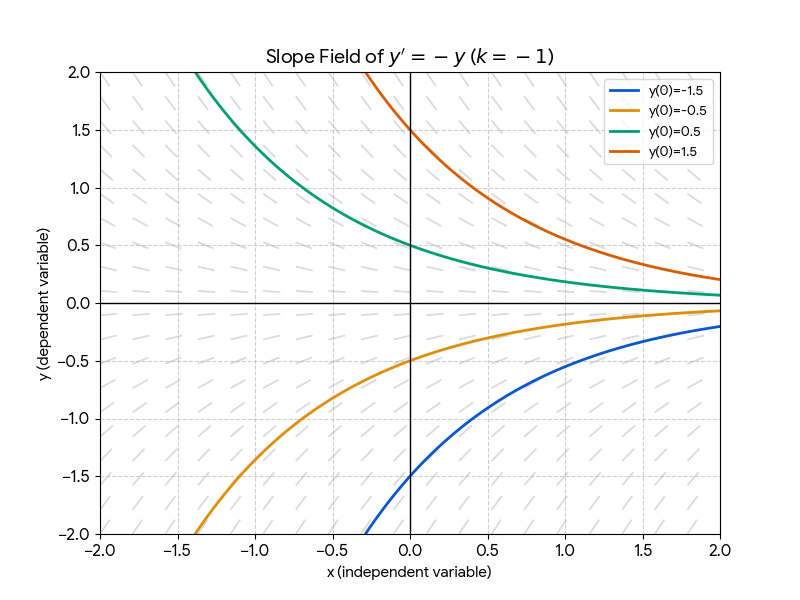
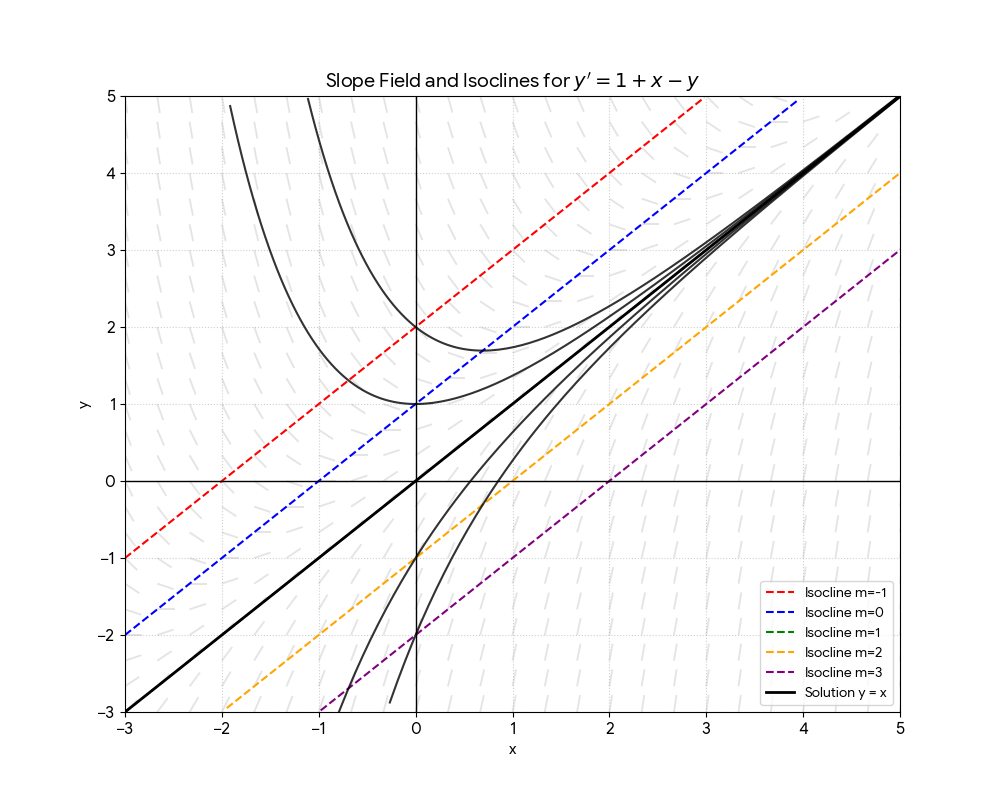
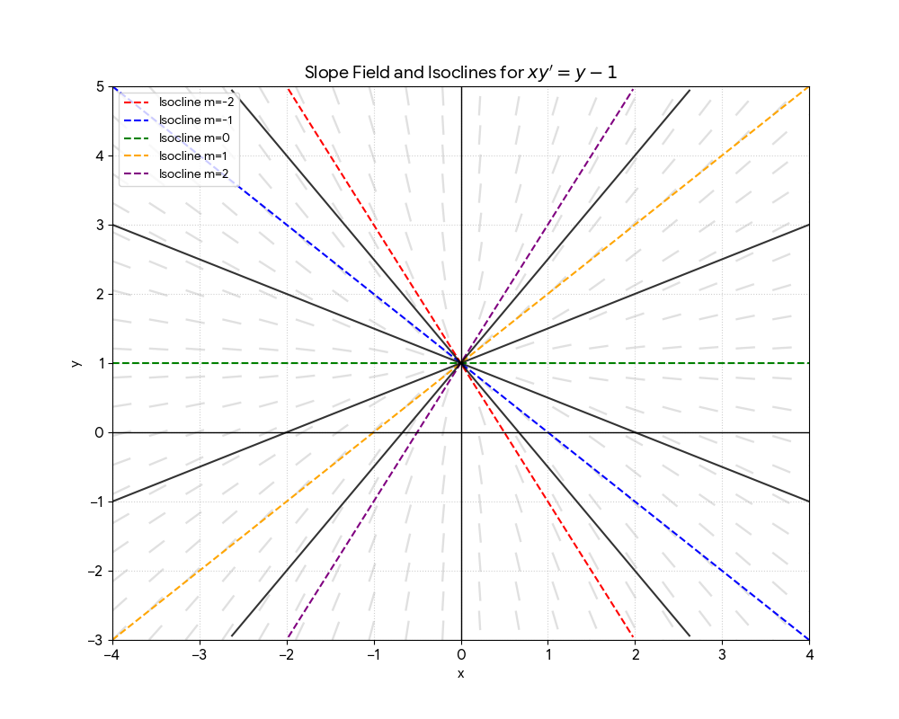

# Week 1: Introduction to Applied Mathematics

---

## 1. The Applied Math Modeling Cycle
Applied mathematics involves using mathematical tools to solve real-world problems. The process follows a continuous loop:

* **Formulation:** Expressing a real-world problem in mathematical language.
* **Modeling:** Building mathematical models based on assumptions and approximations.
* **Analysis/Solving:** Using mathematical tools to find unknown solutions (e.g., $x(t)$).
* **Validation:** Collecting data through experiments to validate the model. 
	* *Note:* If a model (like a pendulum) predicts constant motion but reality shows it slowing down, the model must be refined to include friction.

---

## 2. Ordinary Differential Equations (ODEs)

### Terminology & Classification
* **ODE:** An equation involving a function and its derivatives where there is only one independent variable. 
	* $F(x,y,y',\cdots,y^{(n)})=0$ where $x$ is the independent variable and $y$ is the dependent variable. The unknown is a function $y(x)$.   
* **Variables:**
    * **Independent:** Usually time ($t$) or position ($x$).
    * **Dependent:** The variable being solved for (e.g., $y$, $x$, or $P$).
* **Parameters:** Constants within the system (e.g., mass $m$ or spring constant $k$).
* **Order:** Determined by the highest derivative present (e.g., $y^{(n)}$ is an $n$-th order ODE).

* A general $n$-th order **linear** ODE is expressed as: $$a_n(x)y^{(n)} + a_{n-1}(x)y^{(n-1)} + \dots + a_1(x)y' + a_0(x)y + b(x)=0.$$ 
	* Note: linearity is in terms of $y$ and its derivatives. 

### Classical Examples
**A. Mass-Spring System (Newton's 2nd Law)**
Using the principle of $F = ma$ and Hooke's Law ($F = -kx$):
$$m \frac{d^2x}{dt^2} = -kx$$
This describes Simple Harmonic Motion, which has a **general solution**:
$$x(t) = A \cos(\omega t) + B \sin(\omega t)$$
*The coefficients $A$ and $B$ are determined by Initial Conditions (I.C.): $x(0) = x_0$ and $x'(0) = x'_0$ resulting in a **particular solution**.* 

**B. Population Growth**
The rate of change is proportional to the current population:
$$\frac{dP}{dt} = kP \implies P(t) = P_0 e^{kt}$$

**Note**: a solution can be verified by substituting it to the ODEs and check if the equations hold.

---

## 3. Analytic Methods for First-Order ODEs

### Direct Integration (§1.2)
If the derivative depends only on the independent variable:
$$\frac{dy}{dx} = f(x) \implies y(x) = \int f(x) dx + C$$

### Separable Equations (§1.4)
Used when variables can be moved to opposite sides of the equation:
$$\frac{dy}{dx} = \frac{f(x)}{g(y)} \implies \int g(y) dy = \int f(x) dx$$

### Linear First-Order ODEs (§1.5) (2nd week topic)
Standard form: $y' + p(x)y = q(x)$.
These are solved using an **Integrating Factor**:
$$\mu(x) = e^{\int p(x) dx}$$

---

## 4. Geometric & Qualitative Analysis

### Slope Fields (Direction Fields)
When an ODE is difficult to solve analytically, we visualize it geometrically.
* **Slope Field:** A grid of small lines representing the slope $f(x, y)$ at various points.
* **Integral Curve:** A curve that is tangent to the slope field everywhere; this represents a specific solution.
* **Isoclines:** Curves where the slope $f(x, y) = m$ is constant. These are used to draw slope fields more efficiently.

#### Example (Exponential growth or decay) $y' = k y$
 

#### Example (Crawfish trap) $y' = 1 + x - y$

*note:* all solutions got trapped not matter where it starts and eventually approach $y=x$. $y=x$ is both the isocline of slope 1 and the asymptotic solution  

#### [Clink here to plot slope field using a computer](https://github.com/MathWorks-Teaching-Resources/Phase-Plane-and-Slope-Field) 

### Existence and Uniqueness (E&U)
* **Uniqueness:** In general, integral curves cannot cross or touch. If they did, a single point would have two different solutions.
* **The E&U Theorem:** A unique solution exists near a point $(a, b)$ if both $f(x, y)$ and $\frac{\partial f}{\partial y}$ are continuous in that region.
	* Note: this theorem only concerns "locally" near a point  $(a, b)$. We do not know when E&U breaks. See the example below

 **Example:** ("finite time blow-ups" where a solution goes to infinity in finite time) Consider 
 $$\frac{dy}{dt}=y^2$$
  with $y(0)=1$ 
- separation of variable gives a solution $y=1/(1-t)$. So the solution starting from (0,1) cannot cross $t=1$ 
-  contrast it with exponential growth $\frac{dy}{dt}=y$ with $y(0)=1$

**Example:** (Dichotomous flower) $x y' = y-1$
E&U theorem guarantees E&U everywhere except $x=0$. Examining $x=0$ shows that at (0,1) there many solutions whereas everywhere else on $x=0$ there is no solution. 

*note:* isoclines are also solutions

**Example:** (singularity due to choice of coordinates) 
$$x+yy'=0$$
separation of variable gives  implicit solution $x^2+y^2 = C$. E&U theorem guarantees E&U everywhere except at $y=0$. In fact, solutions do not exist at $y=0$. However changing to polar coordinate resolve this issue. 
